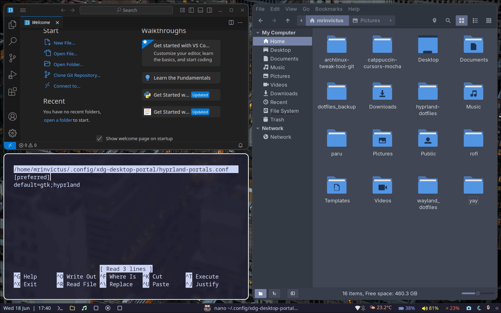

# Arch Linux + Hyprland Rice Showcase by Mert Kaya

Welcome to my personal Arch Linux + Hyprland rice setup. This was my playground for learning the deep internals of Linux, Wayland compositors, and customization from scratch. Now that I'm moving to Linux Mint for stability and daily usage, I'm preserving and sharing this build as a milestone in my Linux journey.

---

## 🌟 Summary

- **WM:** Hyprland (Wayland compositor)
- **Bar:** Waybar
- **Terminal:** Kitty
- **Launcher:** Rofi
- **Notifications:** Dunst
- **File Manager:** Thunar
- **Theme:** Arc-Blue-sky-Dark
- **Icon Theme:** Papirus-Dark
- **Cursor Theme:** Catppuccin-Mocha-Dark
- **Music Controls:** ncmpcpp + custom notifier
- **Weather Widget:** custom `weather.sh` using Open-Meteo
- **Wallpaper Manager:** swaybg

---

## 🧠 Philosophy

This rice focused on:

- Minimal, clean interface
- Blended workspace navigation via gestures and keybinds
- Subtle animations for windows
- Waybar with CPU, RAM, Weather, Music, Power controls
- Offline-resilient scripts (e.g., weather cache fallback)

---

### 🖼️ Screenshots

> Desktop overview:


> Another View


> Wallpaper


---

### 🧰 Modules Used

- Volume & Brightness Controls
- Workspace Indicators
- Spotify/MPD support
- Live Weather (fallback enabled)
- Power Controls (Suspend, Logout, Shutdown)

---

## 📂 Repo Structure

```bash
arch-hyprland-custom/
├── .config/
│   ├── hypr/                # Hyprland config
│   ├── waybar/              # Waybar JSON config + styles
│   ├── rofi/                # Launcher styling
│   ├── kitty/               # Terminal styling
│   ├── dunst/               # Notification styling
├── scripts/                 # Custom bash scripts
│   ├── weather.sh           # Weather info via Open-Meteo
│   ├── ncmpcppnotif.sh      # Music change notifier
├── wallpapers/              # Custom wallpaper(s)
├── screenshots/             # Desktop screenshots
├── LICENSE
└── README.md                # This file
```

---

## ⚙️ Requirements

Install the following tools:

```bash
sudo pacman -S hyprland waybar kitty rofi dunst thunar swaybg playerctl jq curl brightnessctl pamixer ncmpcpp mpd
```

Optional AUR packages:

```bash
yay -S catppuccin-cursors-mocha papirus-icon-theme arc-theme
```

---

## 🚀 Getting Started

Clone the repo:

```bash
git clone https://github.com/mert-kaya/arch-hyprland-custom.git
cd arch-hyprland-custom
```

Copy configs:

```bash
cp -r .config/* ~/.config/
cp -r scripts ~/
```

Reload Hyprland:

```bash
hyprctl reload
```

---

## ❤️ Thanks To

- [Hyprland](https://github.com/hyprwm/Hyprland)
- [Waybar](https://github.com/Alexays/Waybar)
- [Catppuccin](https://github.com/catppuccin/cursors)
- [Papirus Icon Theme](https://github.com/PapirusDevelopmentTeam/papirus-icon-theme)
- [Arch Wiki](https://wiki.archlinux.org/) for always being my sensei

---

Enjoy the rice. Improve it. Fork it. Break it. Rebuild it.

*Mert Kaya*  
*2025*
